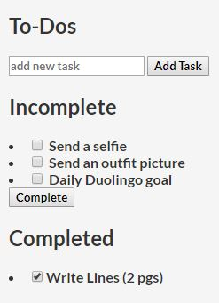

# todo-mini

## A simple To-Do App built with Node.js and Express.

<div style="text-align:center"></div>

## Installation

1. Install all the required dependencies:

```bash
npm install
```

2. Start the server:

```bash
npm run tsc && node build/index.js
```

3. Navigate to the app:

```
http://localhost:3000/
```

### Special Thanks

This app is inspired by [missating](https://github.com/missating)'s [nodejs-todo](https://github.com/missating/nodejs-todo) project. Thanks!
